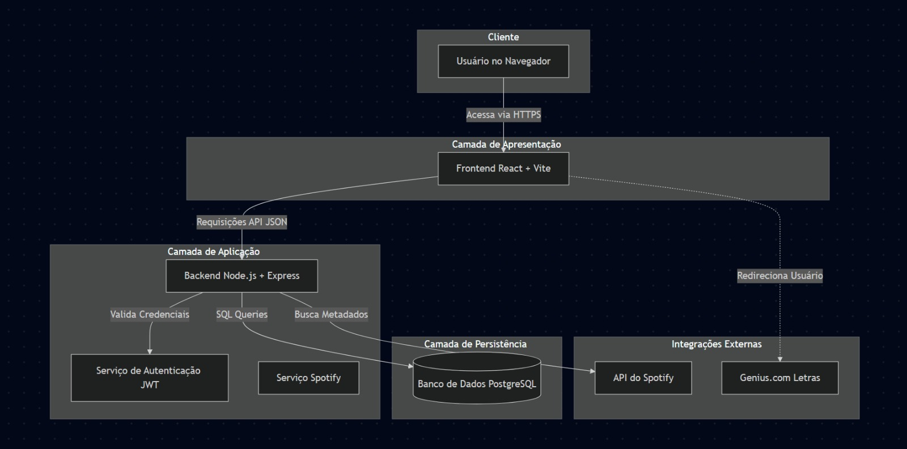
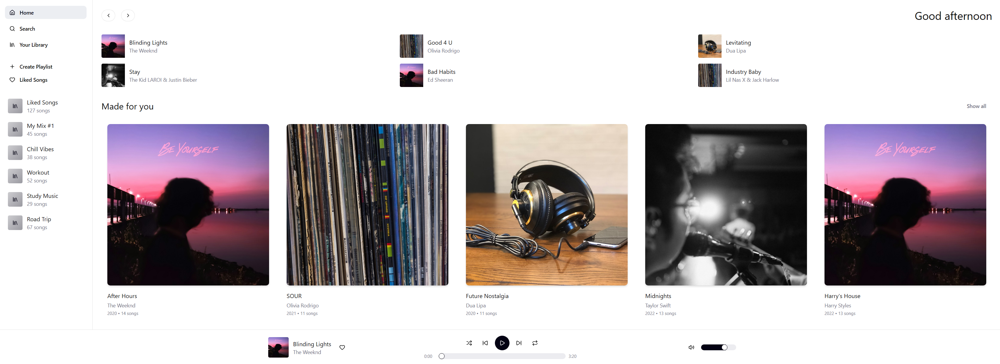
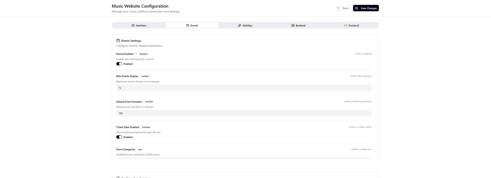
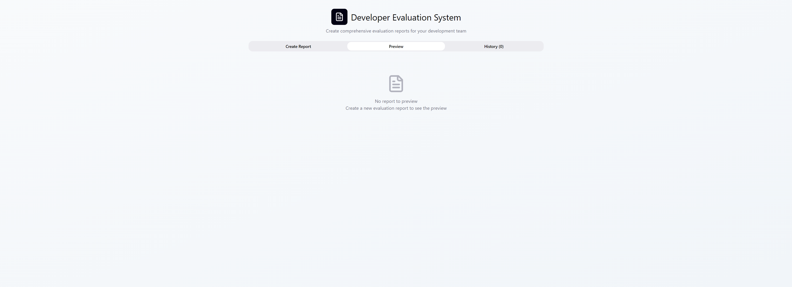
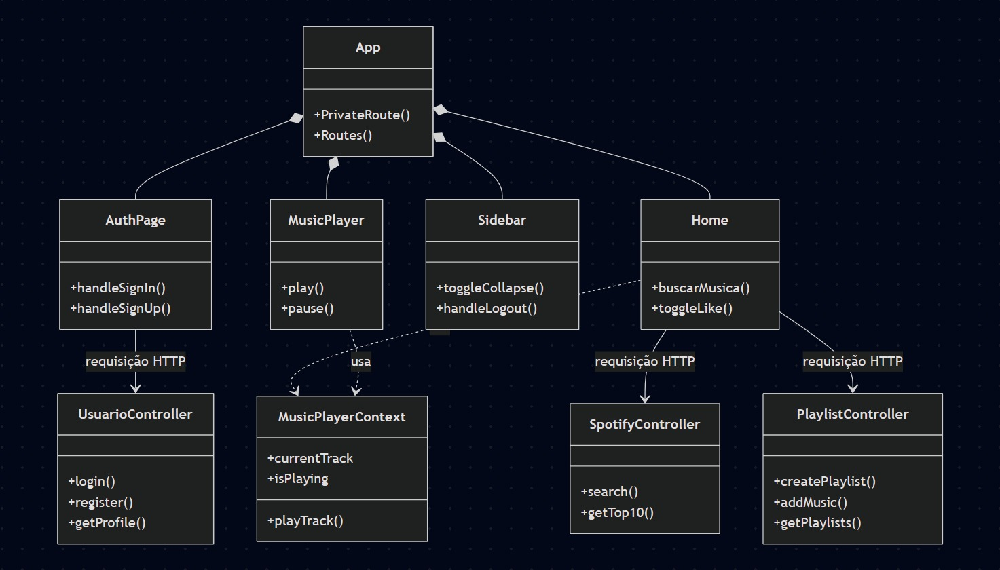

# 4. Projeto da Solução

Este documento detalha a arquitetura, design de telas, modelo de dados e tecnologias empregadas no desenvolvimento do FindMySong, com base na implementação real do projeto.

---

# 4.1. Arquitetura da solução

A arquitetura do FindMySong é baseada em um modelo de três camadas desacopladas (Frontend, Backend, Banco de Dados), hospedadas em serviços de nuvem modernos.

**Camada de Apresentação (Frontend):**  
Uma SPA (Single Page Application) construída em React + TypeScript (com Vite). É responsável por toda a interface do usuário e gerenciamento de estado (como o player de música e a sidebar). É hospedada na Vercel.

**Camada de Aplicação (Backend):**  
Uma API RESTful construída em Node.js + Express.js. Ela serve como um gateway seguro que lida com a lógica de negócios, autenticação (JWT) e se comunica com o banco de dados e APIs externas. É hospedada no Render.

**Camada de Persistência (Banco de Dados):**  
Um banco de dados PostgreSQL que armazena todos os dados gerados pelo usuário (perfis, playlists, curtidas, feedbacks). É hospedado no Render Postgres.

**Integrações Externas:**  
O backend consome a API do Spotify (para busca de músicas e previews) e o frontend redireciona para o Genius (para letras).

---

## Diagrama de Arquitetura da solução


---

# 4.2. Protótipos de telas

A aplicação é composta por 5 processos principais que definem a experiência do usuário, baseados nos protótipos de tela.

---

## 1. Processo de Cadastro/Login

**Tela:** AuthPage.tsx  
**Protótipo:** image_a6a42b.jpg  

**Descrição:**  
Substitui as telas separadas de Login e Cadastro. Apresenta um card centralizado com duas abas: "Sign In" (Entrar) e "Sign Up" (Criar Conta).

**Componentes:**  
- Card  
- Tabs  
- Input  
- Button (shadcn/ui)

**Fluxo:**  
- O usuário preenche o formulário.  
- O AuthPage usa axios para enviar os dados ao backend:  
  - `/api/usuarios/login`  
  - `/api/usuarios/register`  
- Exibe mensagens (toast).  
- Redireciona para `/home`.


---

## 2. Processo de Home e Busca

**Tela:** Home.tsx  
**Protótipo:** image_a6a17f.jpg  

**Descrição:**  
Interface principal do app com duas colunas: Sidebar (esquerda) e conteúdo (direita). Player aparece ao tocar algo.

**Fluxo:**  
- Busca com barra de pesquisa.  
- Cards exibem:  
  - Play  
  - Link do Genius  
  - Link Spotify  
  - Menu “3 pontinhos”  
- Sidebar retrátil salva estado no `localStorage`.




---

## 3. Processo do Painel de Admin

**Tela:** AdminPanel.tsx  
**Protótipo:** image_a6a87f.png  

**Descrição:**  
Página protegida para o email admin. Usa abas (Tabs).

**Fluxo:**  
- Alterna entre abas.  
- Pode trocar tema (Padrão, Halloween, Natal).  




---

## 4. Processo de Opinar sobre a Busca

**Tela:** FeedbackForm.tsx  
**Protótipo:** image_a6a7e8.png  

**Descrição:**  
Formulário exibido após uma busca válida.

**Fluxo:**  
- Usuário seleciona 1–5 estrelas.  
- Pode escrever comentário.  
- Envia para `/api/feedbacks`.


---

## 5. Processo de Gerar Relatório de Opiniões

**Tela:** AdminPanel.tsx – Aba "Feedback"  

**Descrição:**  
Tabela com todos os feedbacks obtidos da rota `/api/feedbacks`.

**Fluxo:**  
- Exibe notas, comentários e data.  
- Botão “Exportar CSV”.




---

## Diagrama de Classes



## **Frontend (React) – `frontend/src/`**

### **Diretórios e Arquivos**

frontend/
└── src/
├── pages/
│ ├── AuthPage.tsx
│ ├── Home.tsx
│ ├── Library.tsx
│ ├── LikedSongs.tsx
│ ├── Top10.tsx
│ ├── AdminPanel.tsx
│ ├── CreatePlaylist.tsx
│ └── Profile.tsx
│
├── components/
│ ├── Sidebar.tsx
│ ├── MusicPlayer.tsx
│ ├── PlaylistMenu.tsx
│ └── FeedbackForm.tsx
│
├── ui/
│ └── (...componentes shadcn/ui)
│
└── contexts/
└── MusicPlayerContext.tsx


### **📌 Descrição dos Arquivos**

**pages/**
- **AuthPage.tsx** – Fluxo de login/cadastro.  
- **Home.tsx** – Tela principal (busca + player).  
- **Library.tsx** – Playlists do usuário.  
- **LikedSongs.tsx** – Músicas curtidas.  
- **Top10.tsx** – Top 10 do Spotify.  
- **AdminPanel.tsx** – Gerencia temas e feedbacks.  
- **CreatePlaylist.tsx** – Criar playlist.  
- **Profile.tsx** – Informações do usuário.

**components/**
- **Sidebar.tsx** – Navegação lateral.  
- **MusicPlayer.tsx** – Player fixo global.  
- **PlaylistMenu.tsx** – Menu para adicionar músicas às playlists.  
- **FeedbackForm.tsx** – Formulário de avaliação 1–5.

**contexts/**
- **MusicPlayerContext.tsx** – Estado global do player (currentTrack, play/pause).

---

## **Backend – `backend/`**

(Baseado no print image_a6a0be.png)

### **Estrutura Simplificada**

backend/
└── server.js


### **Rotas definidas no server.js**

- POST `/api/usuarios/register`
- POST `/api/usuarios/login`
- GET  `/api/spotify/search`
- POST `/api/playlists`
- POST `/api/playlists/:id/musicas`
- POST `/api/likes`
- POST `/api/feedbacks`
- POST `/api/admin/config`
- (E todas as rotas GET correspondentes)

---

## Modelo ER

O Modelo ER representa através de um diagrama como as entidades (coisas, objetos) se relacionam entre si na aplicação interativa.]

As referências abaixo irão auxiliá-lo na geração do artefato “Modelo ER”.

> - [Como fazer um diagrama entidade relacionamento | Lucidchart](https://www.lucidchart.com/pages/pt/como-fazer-um-diagrama-entidade-relacionamento)


# 4.3. Modelo de dados

## 4.3.1 Modelo ER (Descrição)

Entidades:  
- usuarios  
- playlists  
- playlist_musicas  
- curtidas  
- biblioteca  
- feedbacks  
- configuracoes  

### Relacionamentos 1:N

- Um usuario pode ter muitas playlists.  
- Um usuario pode ter muitas curtidas.  
- Um usuario pode ter muitos registros em biblioteca.  
- Uma playlist pode ter muitas playlist_musicas.

### Entidades Independentes

- feedbacks (não referencia usuarios — anônimo)  
- configuracoes (tabela única)

---

## 4.3.2 Esquema Relacional (Conceitual)

usuarios (id, nome, email, senha, avatar_url, data_cadastro)
configuracoes (id, site_name, theme, items_per_page, language, updated_at)
feedbacks (id, query, nota, comentario, data_envio)
curtidas (id, usuario_id, spotify_id, titulo, artista, imagem, url)
biblioteca (id, usuario_id, spotify_id, titulo, artista, imagem, url)
playlists (id, usuario_id, nome, descricao, data_criacao)
playlist_musicas (id, playlist_id, spotify_id, titulo, artista, imagem, url, adicionada_em)


---

## 4.3.3 Modelo Físico (Script SQL)

```sql
-- 1. Tabela usuarios
CREATE TABLE usuarios (
  id SERIAL PRIMARY KEY,
  nome VARCHAR(100) NOT NULL,
  email VARCHAR(100) NOT NULL UNIQUE,
  senha VARCHAR(255) NOT NULL,
  avatar_url TEXT,
  data_cadastro TIMESTAMP DEFAULT NOW()
);

-- 2. Tabela configuracoes
CREATE TABLE configuracoes (
  id SERIAL PRIMARY KEY DEFAULT 1,
  site_name VARCHAR(100),
  theme VARCHAR(50) DEFAULT 'light',
  items_per_page INTEGER DEFAULT 20,
  language VARCHAR(10) DEFAULT 'pt-BR',
  updated_at TIMESTAMP DEFAULT NOW()
);

-- 3. Tabela feedbacks
CREATE TABLE feedbacks (
  id SERIAL PRIMARY KEY,
  query TEXT NOT NULL,
  nota INTEGER NOT NULL CHECK (nota BETWEEN 1 AND 5),
  comentario TEXT,
  data_envio TIMESTAMP DEFAULT NOW()
);

-- 4. Tabela curtidas
CREATE TABLE curtidas (
  id SERIAL PRIMARY KEY,
  usuario_id INTEGER REFERENCES usuarios(id) ON DELETE CASCADE,
  spotify_id VARCHAR(255) NOT NULL,
  titulo TEXT,
  artista TEXT,
  imagem TEXT,
  url TEXT,
  UNIQUE(usuario_id, spotify_id)
);

-- 5. Tabela biblioteca
CREATE TABLE biblioteca (
  id SERIAL PRIMARY KEY,
  usuario_id INTEGER REFERENCES usuarios(id) ON DELETE CASCADE,
  spotify_id VARCHAR(255) NOT NULL,
  titulo TEXT,
  artista TEXT,
  imagem TEXT,
  url TEXT,
  UNIQUE(usuario_id, spotify_id)
);

-- 6. Tabela playlists
CREATE TABLE playlists (
  id SERIAL PRIMARY KEY,
  usuario_id INTEGER REFERENCES usuarios(id) ON DELETE CASCADE,
  nome VARCHAR(100) NOT NULL,
  descricao TEXT,
  data_criacao TIMESTAMP DEFAULT NOW()
);

-- 7. Tabela playlist_musicas
CREATE TABLE playlist_musicas (
  id SERIAL PRIMARY KEY,
  playlist_id INTEGER REFERENCES playlists(id) ON DELETE CASCADE,
  spotify_id VARCHAR(255) NOT NULL,
  titulo TEXT,
  artista TEXT,
  imagem TEXT,
  url TEXT,
  adicionada_em TIMESTAMP DEFAULT NOW(),
  UNIQUE(playlist_id, spotify_id)
);
```


### 4.4. Tecnologias

Tecnologias Utilizadas

O FindMySong utiliza uma stack moderna de JavaScript/TypeScript, dividida em Frontend, Backend e Banco de Dados.


Frontend
| Tecnologia           | Descrição                                          |
| -------------------- | -------------------------------------------------- |
| **React (Vite)**     | Biblioteca principal usada para a interface SPA.   |
| **TypeScript**       | Adiciona tipagem estática e segurança ao código.   |
| **Tailwind CSS**     | Framework “utility-first” para estilização rápida. |
| **shadcn/ui**        | Biblioteca de componentes (Cards, Inputs, Tabs).   |
| **react-router-dom** | Roteamento entre páginas.                          |
| **axios**            | Cliente HTTP para comunicação com o backend.       |
| **lucide-react**     | Biblioteca de ícones usada no projeto.             |


Backend
| Tecnologia             | Descrição                                             |
| ---------------------- | ----------------------------------------------------- |
| **Node.js**            | Ambiente de execução JavaScript no servidor.          |
| **Express.js**         | Framework web para criação da API RESTful.            |
| **pg (node-postgres)** | Cliente para executar queries no PostgreSQL.          |
| **CORS**               | Middleware para permitir comunicação Vercel → Render. |
| **bcrypt.js**          | Para hash das senhas.                                 |
| **jsonwebtoken (JWT)** | Tokens de autenticação para sessões.                  |


Banco de Dados
| Tecnologia     | Descrição                                     |
| -------------- | --------------------------------------------- |
| **PostgreSQL** | Banco relacional que armazena todos os dados. |


Ferramentas
| Ferramenta     | Descrição                              |
| -------------- | -------------------------------------- |
| **Render**     | Hosting do backend + banco PostgreSQL. |
| **Git/GitHub** | Controle de versão do código.          |
| **pgAdmin**    | Gerenciamento visual do PostgreSQL.    |
| **VS Code**    | Editor de código utilizado.            |


Fluxo de Interação das Tecnologias


[ Usuário Navegador ]
        |
        v
[ Frontend React - Vercel ]
        |
   (axios /api/...)
        v
[ Backend Node/Express - Render ]
        |
   +----+-------------------+
   |                        |
   v                        v
[ PostgreSQL ]        [ API Spotify ]
        |
        v
[ Genius.com - Letras ]


