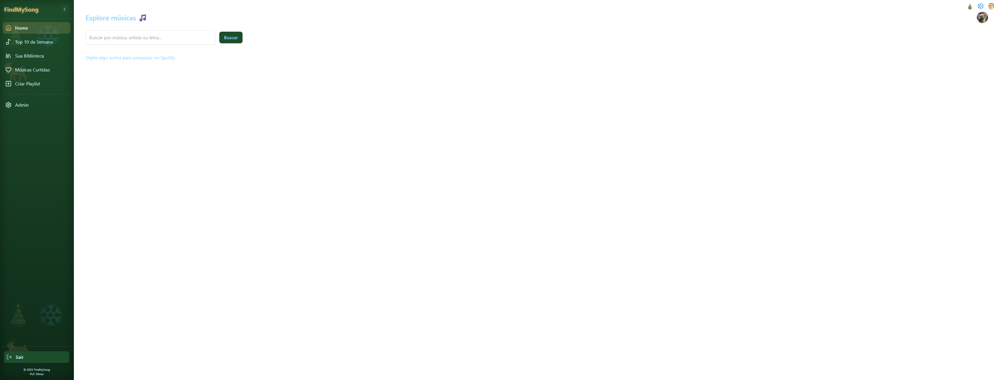
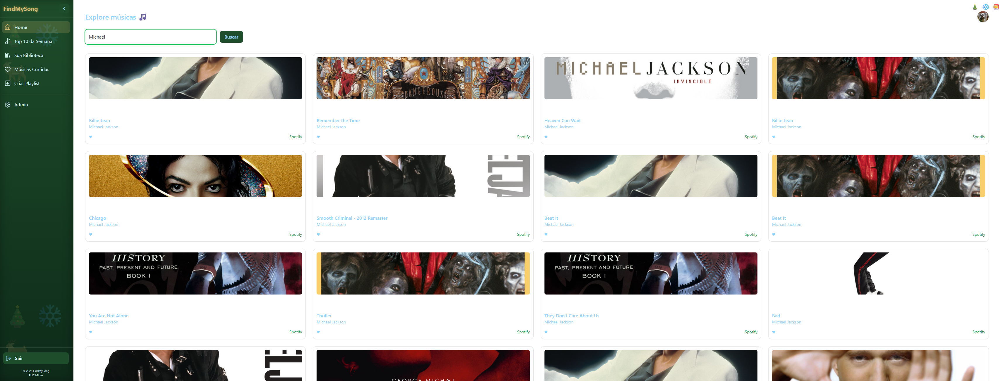
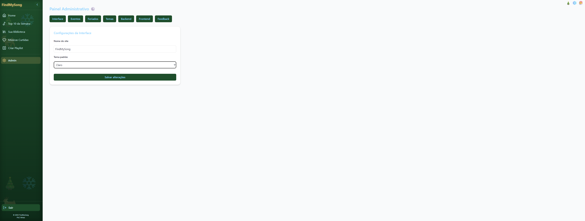
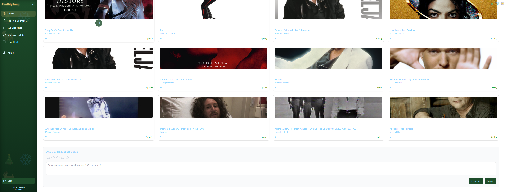
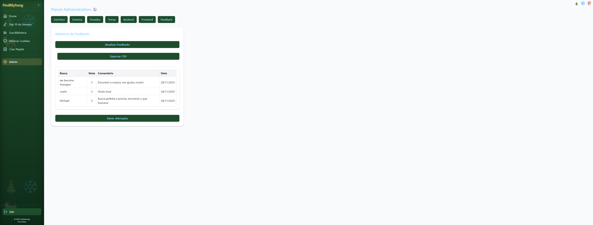

# 6. Interface do Sistema

Pré-requisitos: <a href="4-Projeto-Solucao.md"> Projeto da Solução</a>

_Visão geral da interação do usuário por meio das telas do sistema. Apresente as principais interfaces da plataforma._

---

## 6.1. Tela principal do sistema (Home)

_A tela principal é o ponto central de navegação do usuário._

Ela apresenta:

- Barra lateral retrátil para acesso rápido às funcionalidades.  
- Barra de busca no topo.  
- Sessões como “Made for you” e resultados de pesquisa exibidos em cards.

Ao clicar em um card, o usuário pode ouvir um preview de 30 segundos, visualizar a letra no Genius ou abrir a música no Spotify.

---

## 6.2. Telas do Processo 1 – Cadastro e Login

_Descrição das telas relacionadas ao processo de autenticação._

A tela de autenticação fornece duas abas:

- **Sign In (Login):** acesso à conta existente.  
- **Sign Up (Cadastro):** criação de uma nova conta com nome, e-mail e senha.

---

## 6.3. Telas do Processo 2 – Home e Busca

_Descrição das telas relativas à busca e descoberta de músicas._

A tela de busca permite encontrar músicas por trecho, nome ou artista.  
Os resultados são exibidos em cards com opções para visualizar letra, ouvir preview e adicionar à playlist.

---

## 6.4. Telas do Processo 3 – Painel Administrativo

_Descrição das telas relativas à administração do sistema._

O painel administrativo contém abas para:

- Alterar tema visual (Padrão, Halloween, Natal).  
- Configurar eventos.  
- Ajustar parâmetros gerais da plataforma.

---

## 6.5. Telas do Processo 4 – Opinar sobre a Busca

_Descrição da tela de feedback do usuário._

Após uma busca, o usuário pode avaliar a precisão dos resultados com nota de **1 a 5 estrelas**, além de deixar um comentário opcional.

[`Tela de Feedback`](images/)

---

## 6.6. Telas do Processo 5 – Gerar Relatório de Opiniões

_Descrição das telas de análise pelos administradores._

A aba **Feedback** no painel administrativo exibe uma tabela com:

- Termo buscado  
- Nota  
- Comentário  
- Data da avaliação  

O administrador pode também exportar os dados em **CSV**.

---
