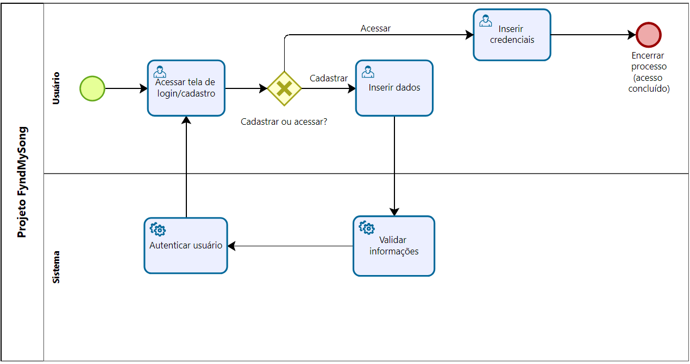

# 3.3.1 Processo 1 – Autenticação e Gerenciamento de Usuários  

**Oportunidades de melhoria:** Garantir segurança, personalização e níveis de acesso diferentes.  

# **Descrição das atividades do processo**
Este processo gerencia o acesso do usuário, cobrindo o cadastro de novas contas e o login. O usuário escolhe entre se cadastrar ou acessar. No cadastro, ele insere e valida seus dados. No acesso, ele insere suas credenciais. Ambos os caminhos levam ao acesso concluído.

**Fluxo BPMN (descrição):**  
1. Usuário acessa tela de login/cadastro.  
2. Gateway: usuário escolhe cadastrar ou acessar.  
3. Se cadastrar: usuário insere dados → sistema valida → sistema autentica/ativa perfil → processo encerrado (acesso concedido).
4. Se acessar: usuário insere credenciais → sistema valida/autentica → processo encerrado (acesso concedido).
5. Em caso de falha na validação, o sistema retorna mensagem de erro e permite nova tentativa ou recuperação de senha.

**Detalhamento das atividades:**  

## **Atividade 3: Inserir dados (Cadastro)**
* **Participante:** Usuário
* **Descrição:** O usuário preenche o formulário para criar uma nova conta.

| Campo           | Tipo de dado   | Restrições                                   | Valor default |
| :-------------- | :------------- | :------------------------------------------- | :------------ |
| Nome completo   | Caixa de Texto | Máximo de 100 caracteres                     | -             |
| E-mail          | Caixa de Texto | Formato de e-mail válido                     | -             |
| Senha           | Caixa de Texto | Mínimo de 8 caracteres, com letras e números | -             |
| Confirmar Senha | Caixa de Texto | Deve ser idêntico ao campo Senha             | -             |

| Comandos            | Destino                                                | Tipo    |
| :------------------ | :----------------------------------------------------- | :------ |
| Cadastrar           | Envia os dados para a atividade "Validar informações"  | default |
| Já tenho uma conta  | Redireciona para a atividade "Inserir credenciais"     | cancel  |

## **Atividade 4: Inserir credenciais (Login)**
* **Participante:** Usuário
* **Descrição:** O usuário informa seu e-mail e senha para acessar a plataforma.

| Campo | Tipo de dado   | Restrições        | Valor default |
| :---- | :------------- | :---------------- | :------------ |
| E-mail| Caixa de Texto | Formato de e-mail | -             |
| Senha | Caixa de Texto | -                 | -             |

| Comandos      | Destino                                                | Tipo    |
| :------------ | :----------------------------------------------------- | :------ |
| Acessar       | Encaminha para a página principal (acesso concluído)   | default |
| Criar conta   | Redireciona para a atividade "Inserir dados"           | cancel  |

---
