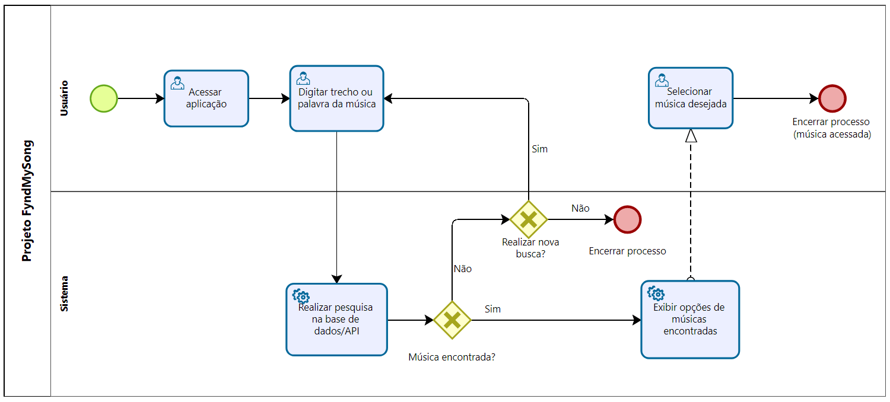

### 3.3.1 Processo 1 – Busca e Exibição de Músicas por Trecho da Letra  

**Oportunidades de melhoria:** Automatizar a busca para que o usuário obtenha resultados de forma rápida, precisa e integrada a plataformas oficiais.  

# **Descrição das atividades do processo**
O processo de busca de música inicia quando o usuário acessa a aplicação e insere um trecho da letra ou uma palavra-chave. O sistema, então, realiza uma busca em sua base de dados. Se músicas forem encontradas, elas são exibidas para o usuário, que pode selecionar a desejada, encerrando o processo com sucesso. Caso a busca não retorne resultados, o usuário pode realizar uma nova pesquisa ou encerrar o processo.

**Fluxo BPMN (descrição):**  
1. Usuário acessa a aplicação.  
2. Digita o trecho lembrado da música.  
3. Sistema pesquisa na API/base de dados.  
4. Resultados são exibidos (título, artista e link para streaming).  
5. Usuário seleciona a música desejada.  

**Detalhamento das atividades:**  

# **Atividade 1: Acessar aplicação**
* **Participante:** Usuário
* **Descrição:** O usuário abre a plataforma FyndMySong.

#### **Atividade 2: Digitar trecho ou palavra da música**
* **Participante:** Usuário
* **Descrição:** O usuário insere o texto para a busca no campo de pesquisa.

| Campo           | Tipo de dado   | Restrições             | Valor default |
| :-------------- | :------------- | :--------------------- | :------------ |
| Busca por letra | Caixa de Texto | Mínimo de 3 caracteres | -             |

| Comandos | Destino                                                                 | Tipo    |
| :------- | :-------------------------------------------------------------------    | :------ |
| Buscar   | Envia o texto para a atividade "Realizar pesquisa na base de dados/API" | default |

#### **Atividade 5: Selecionar música desejada**
* **Participante:** Usuário
* **Descrição:** O usuário clica na música que deseja visualizar na lista de resultados.

| Comandos             | Destino                                                   | Tipo    |
| :------------------- | :-------------------------------------------------------- | :------ |
| Clicar no item da lista | Encaminha para a página da música e encerra o processo | default |

---
