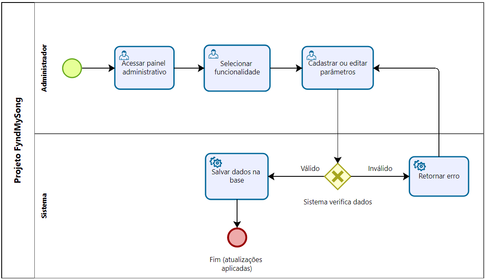

# 3.3.3 Processo 3 – Cadastro e Atualização de Informações 

**Oportunidades de melhoria:** Permitir que administradores atualizem parâmetros do sistema de forma centralizada, sem necessidade de alterações manuais em código. Isso inclui ajustes na interface, registro de eventos e feriados, além de configurações de backend e frontend.  

### **Descrição das atividades do processo**
Este processo descreve a rotina de um administrador para configurar o sistema. O fluxo começa com o acesso ao painel administrativo. O administrador então cadastra ou edita os parâmetros desejados. O sistema valida os dados: se forem válidos, são salvos; se inválidos, o sistema retorna um erro para correção.

**Fluxo BPMN (descrição):**  
1. Administrador acessa o painel administrativo.  
2. Seleciona a funcionalidade desejada (interface, eventos, feriados, backend ou frontend).  
3. Realiza cadastro ou atualização das informações.  
4. Sistema salva e aplica as alterações na base/configuração.  
5. Atualizações ficam disponíveis imediatamente para os usuários do sistema.  

**Detalhamento das atividades:**  

## **Atividade 3: Cadastrar ou editar parâmetros**
* **Participante:** Administrador
* **Descrição:** O administrador preenche os campos de configuração da funcionalidade selecionada.

| **Campo**          | **Tipo**       | **Restrições**             | **Valor default** |
|--------------------|----------------|----------------------------|-------------------|
| evento_feriado     | Caixa de Texto | opcional                   | vazio             |
| data_evento        | Calendário     | formato DD/MM/AAAA         | vazio             |
| ajuste_interface   | Dropdown       | seleção de tema/opções     | padrão do sistema |
| config_backend     | Área de Texto  | parâmetros técnicos        | vazio             |
| config_frontend    | Área de Texto  | parâmetros técnicos        | vazio             |

**Comandos principais:**  

| **Comando** | **Destino**                                        | **Tipo**             |
|-------------|----------------------------------------------------|----------------------|
| Salvar      | Base/configuração                                  | default              |
| Editar      | Base/configuração                                  | default              |
| Publicar    | Sistema                                            | aplica em tempo real |
| Cancelar    | Retorna para a tela de "Selecionar funcionalidade" | cancel               |

---
