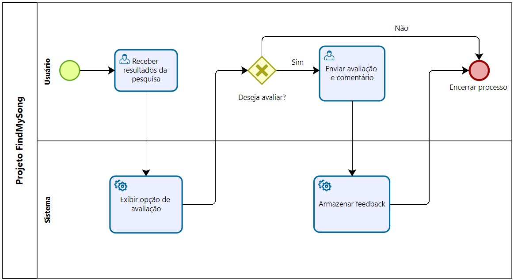

### 3.3.3 Processo 3 – Feedback dos Usuários  

**Oportunidades de melhoria:** Estruturar um processo de coleta de opinião para refinar a busca.  

# **Descrição das atividades do processo**
Este processo permite que o usuário forneça feedback sobre os resultados de uma pesquisa. Após receber os resultados, o sistema oferece a opção de avaliação. Se o usuário aceitar, ele envia uma nota e um comentário, que são armazenados. Caso contrário, o processo encerra.

**Fluxo BPMN (descrição):**  
1. Usuário recebe resultados.  
2. Sistema exibe opção de avaliar precisão.  
3. Usuário envia feedback (positivo/negativo + comentário opcional).  
4. Sistema armazena feedback para análise posterior.  

**Detalhamento das atividades:**  

| **Campo**    | **Tipo**        | **Restrições**                                     | **Valor default** |
|--------------|-----------------|----------------------------------------------------|------------------ |
| Avaliação    | Seleção (1-5)   | Somente será permitida a escolha de uma opção      | vazio             |
| Comentário   | Caixa de Texto  | Máximo de 500 caracteres                           | vazio             |

| **Comando** | **Destino**                                              | **Tipo**   |
|-------------|--------------------------------------------------------- |------------|
| Enviar      | Envia os dados para a atividade "Armazenar feedback"     | default    |
| Cancelar    | Encerra o processo                                       | cancel     |

---
